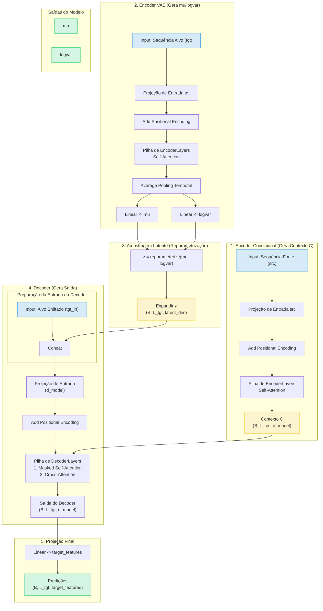

# Transformer Conditional Variational Autoencoder (T-CVAE)

### 1. Resumo Técnico

- **Positional encoding:** `_build_sinusoidal_position_encoding(max_len, d_model)`.

- **MultiHeadAttention:** Projeções lineares `(q/k/v/out)`, `split/combine heads`, produto escalar escalarizado + softmax + dropout.

- **FeedForward:** `lin1 -> ReLU -> dropout -> lin2`.

- **EncoderLayer:** `Self-attention + dropout + LayerNorm, seguido por FeedForward + dropout + LayerNorm`.

- **Encoder (conditional_encoder):** Projeção de entrada `(input_features → d_model)`, adição de positional encoding, pilha de EncoderLayer. Retorna contexto condicional C.

- **VAEEncoder:** Usa um Encoder para processar a sequência alvo `(target_features → d_model)`. Faz pooling (média) sobre a dimensão temporal. Projeta para `mu` e `logvar`.

- **DecoderLayer:** Masked `self-attention` (causal) + cross-attention (sobre `enc_out/C`) + `FeedForward` (com `LayerNorms` e `dropout`).

- **Decoder:** Concatena `z` (latente) expandido com `tgt`. Projeta (`target_features` + `latent_dim`) → `d_model`. Adiciona positional encoding. Pilha de `DecoderLayer`.å

### Transformer C-VAE:

- **conditional_encoder:** Processa `src → contexto C`.

- **vae_encoder:** Processa `tgt → mu e logvar`.

- **reparameterize:** `(mu, logvar) → z`.

- **decoder:** Recebe `tgt_in, z, C` e gera representações.

- **final_projection:** `d_model → target_features`.

- **forward retorna:** `(predictions, mu, logvar)`.

### 2. Diagrama da Arquitetura (Fluxo de Dados)

O diagrama abaixo ilustra o fluxo de dados (inputs src e tgt) através do modelo para gerar as predições finais, mu e logvar.

