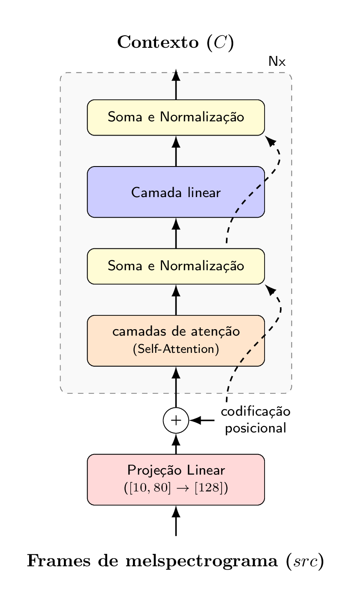
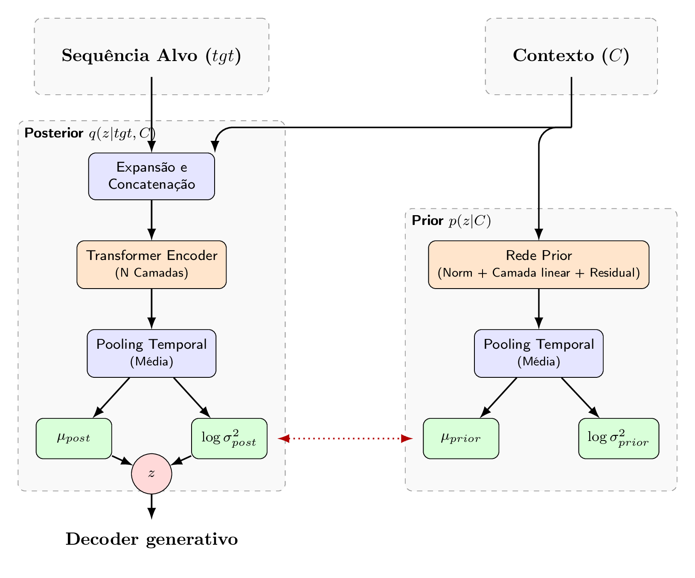
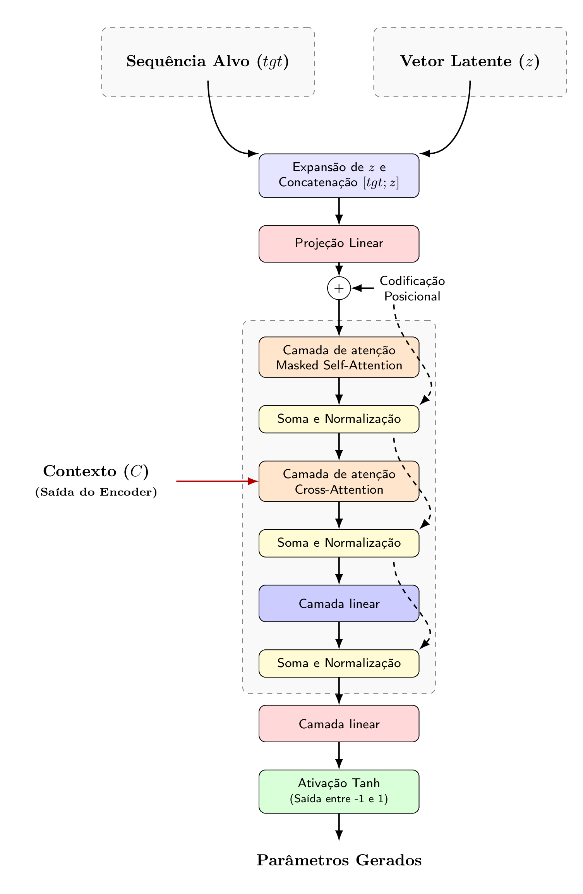

# Transformer Conditional Variational Autoencoder (T-CVAE)

Implementation of a Transformer Conditional Variational Autoencoder model to map flute gestures and articulations to a set of synthesis parameters. This model is used to control synthesis and sound signals processing in real time

### 1. Technical overview

- **Positional encoding:** `_build_sinusoidal_position_encoding(max_len, d_model)`.

- **MultiHeadAttention:** linear projections `(query, key, value)`, `split/combine heads`, scalar product + softmax + dropout.

- **FeedForward:** `linear layer 1 -> ReLU -> dropout layer -> linear layer 2`.

- **EncoderLayer:** `Self-attention + dropout + layer normalization -> FeedForward + dropout + layer normalization`.

- **Encoder (conditional_encoder):** Conditional encoder to project the input src `(melspectrogram frames [10, 80] → d_model [128])` -> stacked EncoderLayer -> context C

- **VAEEncoder:** Variational encoder to concatenate the context C with target features and process it`(target_features [10, 20] → d_model [128] + context C [128])` -> pooling (average) on temporal dimension -> `mu` and `logvar`.

- **DecoderLayer:** Masked `self-attention` (causal) + cross-attention (one `enc_out/C`) + `FeedForward` (with `layer normalization` and `dropout`).

- **Decoder:** Concatena `z` (latent) expanded with `tgt`. project (`target_features` + `latent_dim`) → `d_model`. Add positional encoding -> stacked `DecoderLayer`.

### 2. Transformer C-VAE:

- **1. Conditional Encoder:** process `input → contexto C`.
  

- **2. Variational Encoder:** process `tgt and C → mu/logvar`.
  

- **Reparametrization trick:** `(mu, logvar) → z`.

- **3. Generative Encoder:** receices `tgt_in, z, C` and generate the output targets
  
